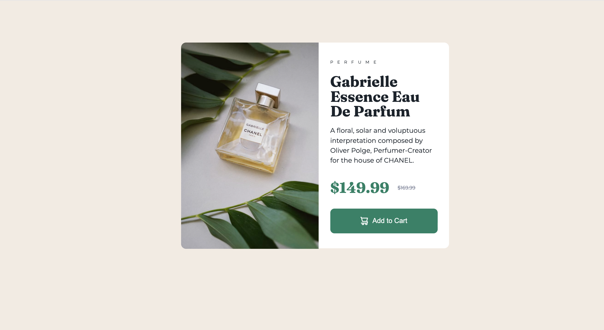

# Frontend Mentor's Product Preview Card Challenge
## Overview
In this repository, I have attempted to replicate the design of Frontend Mentor's Product Preview Card Challenge, found [here](https://www.frontendmentor.io/challenges/product-preview-card-component-GO7UmttRfa).
## Built With
* HTML
* CSS
## Challenges
Whenever I had previously used "border-radius", it was always to round all of the corners of an object.  But, while working through this project, I learned that you can target specific corners.  I also ran into some problems with relative paths when defining the fonts, but eventually I overcame this minor hurdle.
## Finished Results
The finished assignment can be reviewed [here on Github Pages](https://grimmaldi.github.io/fe-mentors-product-preview-card/).  The final image can also be seen in the screenshot below.

